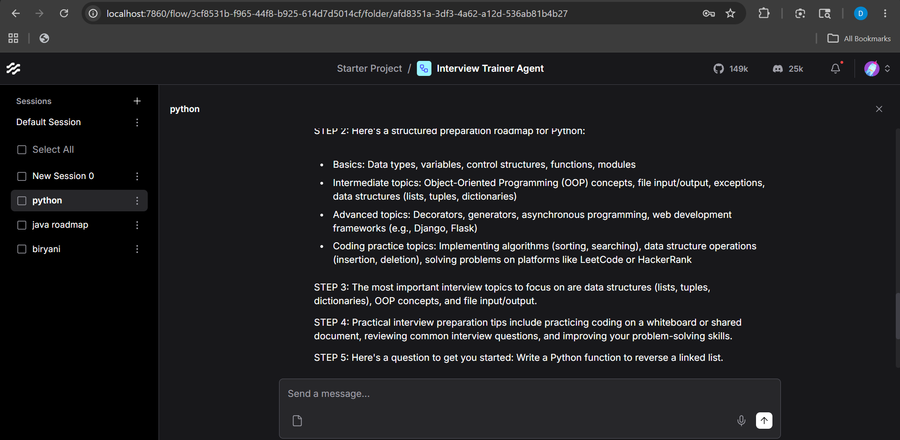
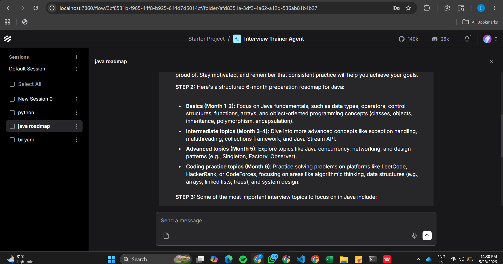
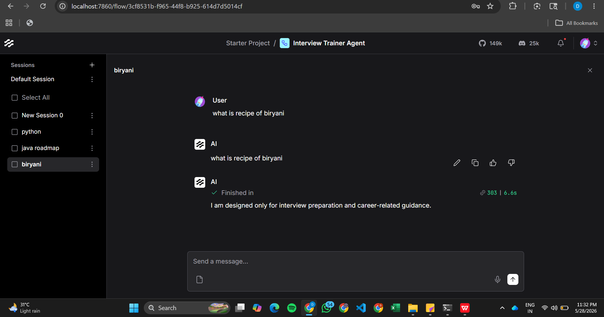

# Interview Trainer Agent

AI-powered Interview Preparation Assistant built using Langflow and IBM watsonx.ai.

## Project Overview

This project helps users prepare for technical interviews by generating:

- Interview preparation roadmaps
- Important concepts to revise
- Coding practice suggestions
- Technical interview tips
- HR interview tips
- Progressive interview questions

The agent is restricted to interview preparation and career-related guidance.

## Technologies Used

- Langflow
- IBM watsonx.ai
- Meta Llama 3 70B Instruct
- GitHub

## Workflow

User Input → Message History → IBM watsonx.ai → Chat Output

## Project Files

- Interview_Trainer_Agent.json
- Workflow Diagram
- Architecture Blueprint
- Demo Screenshots

## Demo Screenshots

### Python Interview Demo

### Java Roadmap Demo

### Restricted Query Demo

## Author

Dhana Vikhyat Pinnamareddy
B.Tech IoT Student
